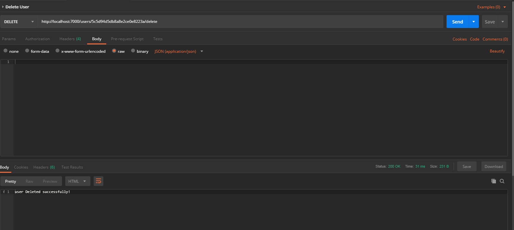

"# Node-Simple-API-CURD"

## Steps

- Download the source
- run Npm Install
- run make sure you have nodemon
- run nodemon index.js
- import the API collection which is names as CURD to POSTMAN
- Enjoy The Coding !!

##  Create User

##  Read User

##  Update User

##  Delete User

##  List User

